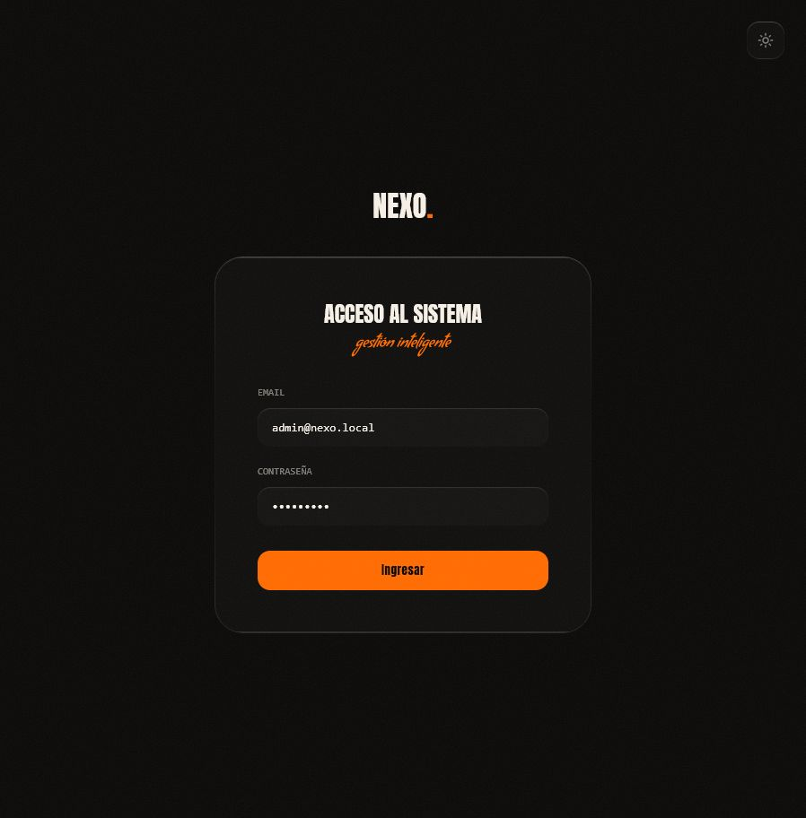
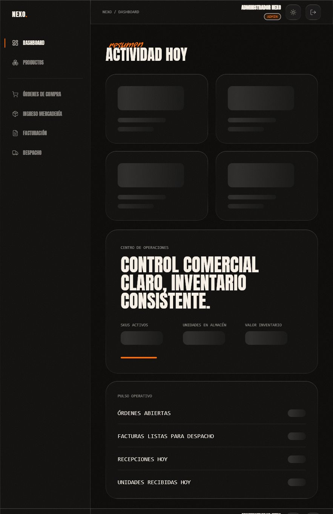
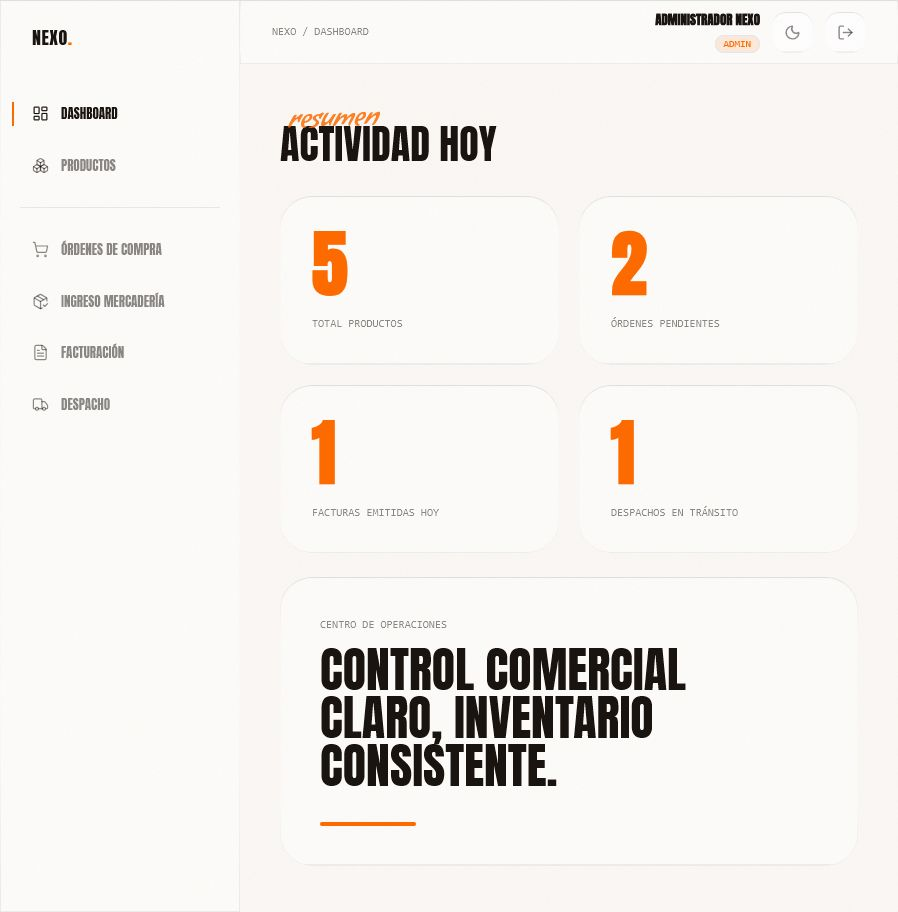
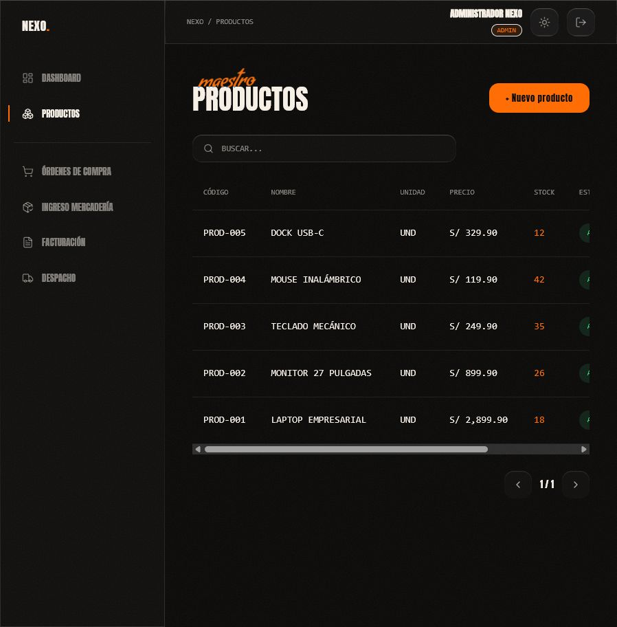
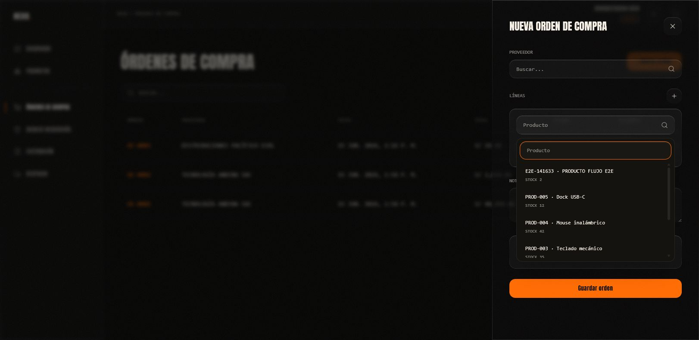
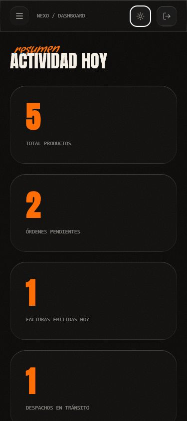

# NEXO. Sistema de Gestión Comercial


Aplicación fullstack para login, productos, órdenes de compra, ingreso de mercadería, facturación y despacho. Incluye modo claro/oscuro, diseño liquid-glass, stock transaccional, Swagger, pruebas y despliegue preparado.

## Quickstart

```bash
copy .env.example .env
docker compose up --build
```

- Aplicación: `http://localhost:8080`
- Frontend directo: `http://localhost:5173`
- API: `http://localhost:3000/api`
- Swagger: `http://localhost:3000/api/docs`
- pgAdmin: `docker compose --profile tools up` y abrir `http://localhost:5050`

Credenciales de desarrollo:

| Rol | Usuario | Contraseña |
|---|---|---|
| ADMIN | `admin@nexo.local` | `Admin123!` |
| OPERATOR | `operador@nexo.local` | `Operator123!` |

## Comandos

```bash
npm ci
npm run build
npm run test
npm run lint
```

## Documentación

- [Arquitectura](docs/ARCHITECTURE.md)
- [API](docs/API.md)
- [Supuestos](docs/SUPUESTOS.md)
- [Auditoría contra el prompt maestro](docs/AUDITORIA_PROMPT.md)
- [Script SQL de base de datos](database/schema.sql)

## Capturas

### Login



### Dashboard





### Productos



### Selector buscable corregido



### Responsive



## Producción

El frontend está publicado en Vercel y el backend está preparado para Railway. La URL final de la API se completa al conectar Railway/PostgreSQL y secretos externos; no se incluyen credenciales en el repositorio.

### Entregables solicitados

- Código fuente: publicar este directorio como repositorio Git.
- Script de base de datos: `database/schema.sql` contiene el DDL PostgreSQL inicial; las migraciones oficiales están en `backend/prisma/migrations`.
- Arquitectura: `docs/ARCHITECTURE.md`.
- Frontend Vercel: `https://frontend-chi-ten-11.vercel.app` (SPA publicada y verificada con HTTP 200).
- Backend/API: desplegar `backend/Dockerfile` en Railway o servicio compatible y configurar PostgreSQL.

### Variables para despliegue

Vercel:

```bash
VITE_API_URL=https://<backend-public-url>/api
```

Backend:

```bash
DATABASE_URL=postgresql://...
JWT_ACCESS_SECRET=<secret-32-plus-chars>
JWT_REFRESH_SECRET=<secret-32-plus-chars>
CORS_ORIGIN=https://<vercel-url>
NODE_ENV=production
```

Sin una URL pública del backend, Vercel sirve la SPA, pero login y módulos comerciales no pueden consumir la API en producción.
